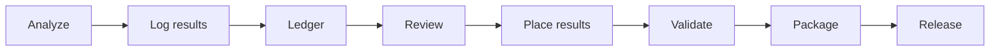

# results-db skill
[](https://github.com/batikas/results-db-skill/actions/workflows/ci.yml)

Structured results ledger for empirical research papers.

This skill helps you track, query, and manage regression results so the paper narrative stays aligned with the actual estimates. It is designed for quantitative social-science and economics projects with many specifications, heterogeneity splits, robustness checks, and revision cycles.

## Requirements

- Python 3.10 or newer
- No third-party Python dependencies for the core CLI

## Installation

If you are publishing or testing through Claude Code, install the skill from the local repository or GitHub mirror.

Example for a GitHub install:

```bash
claude plugin install github:batikas/results-db-skill
```

For local development, clone the repo and work from the repository root.

## What this skill does

- Logs one row per estimate into a project CSV database
- Filters and summarizes results by section, estimator, sample, significance, and validation status
- Tracks what belongs in the main text, appendix, or should be dropped
- Records pre-trend and Honest DiD checks
- Exports summary tables and checks database integrity before submission

## When to use it

Use this skill when you need to:

- Decide which estimates belong in the paper
- Check what is still `tbd`
- Summarize the story of your results
- Add new estimates after running analysis
- Update a result after changing specifications
- Audit whether parallel trends or Honest DiD checks passed

## Workflow



The workflow is intentionally simple: analyze, log, review, place, validate, package, release.

## Repository layout

```text
results-db-skill/
├── README.md
├── .gitignore
├── LICENSE
├── VERSION
├── CITATION.cff
├── RELEASE_CHECKLIST.md
├── scripts/
│   └── package_skill.py
├── examples/
│   ├── README.md
│   ├── example_estimates.csv
│   └── example_results_database.csv
├── tests/
│   └── test_package_skill.py
├── .claude-plugin/
│   └── plugin.json
├── .github/
│   ├── pull_request_template.md
│   ├── ISSUE_TEMPLATE/
│   │   ├── bug_report.md
│   │   └── feature_request.md
│   └── workflows/
│       ├── ci.yml
│       └── release.yml
├── skills/
│   └── results-db/
│       ├── SKILL.md
│       └── scripts/
│           ├── results_db.py
│           └── populate_example.py
└── references/
    └── publishing.md
```

If you are using the installed local Claude skill rather than a published GitHub repo, keep the same commands but drop the `skills/results-db/` prefix.

## Quick start

1. Initialize a database for your project:

```bash
python skills/results-db/scripts/results_db.py init --project .
```

2. Check what is already in the paper and what is still pending:

```bash
python skills/results-db/scripts/results_db.py status --project .
python skills/results-db/scripts/results_db.py show --project . --in_paper tbd
```

3. Log a new estimate:

```bash
python skills/results-db/scripts/results_db.py add --project . \
  --section package --hypothesis H1 --estimator "C&S" \
  --dv delta_num_as_dep --dv_label "Δ Downstream (monthly flow)" \
  --sample DepQ4 --att 0.2194 --se 0.0789 --p 0.007 --sig "***" --n 24336 \
  --in_paper main \
  --language Python --model_spec "C&S DiD, pkg+month FE, HC1 SEs" \
  --pre_trend_test "RI p=0.000" --pre_trend_pass pass \
  --honest_did_m "0.025" --honest_did_pass pass \
  --table_file "results/tables/downstream_table_all_estimators_by_dep_quartile_py.tex"
```

4. Generate a narrative summary:

```bash
python skills/results-db/scripts/results_db.py story --project .
```

5. Run integrity checks before submission:

```bash
python skills/results-db/scripts/results_db.py lint --project .
```

6. Populate a database from a project CSV with the example loader:

```bash
python skills/results-db/scripts/populate_example.py \
  --project . \
  --input results/tables/example_estimates.csv \
  --section package \
  --estimator "C&S" \
  --model-spec "C&S DiD, pkg+month FE, HC1 SEs"
```

7. Package the repo for release:

```bash
python scripts/package_skill.py --repo-root .
```

8. Run the test suite:

```bash
make test
```

## Core commands

All commands accept `--project /path/to/project` or `--db /explicit/path/to/db.csv`.

### `init`

Creates `results/results_database.csv` for a project.

### `show`

Filters rows by section, estimator, significance, sample, language, or validation status.

Examples:

```bash
python skills/results-db/scripts/results_db.py show --project . --section mechanism
python skills/results-db/scripts/results_db.py show --project . --in_paper main
python skills/results-db/scripts/results_db.py show --project . --pre_trend_pass fail
```

### `story`

Produces a narrative summary of the strongest results, grouped by section and hypothesis.

### `status`

Shows how many rows are `main`, `appendix`, `dropped`, or `tbd`.

### `add`

Adds a new estimate. One row should correspond to one estimate, not one table.

### `update`

Updates placement, notes, validation flags, or file references for an existing row.

### `export`

Exports a markdown, LaTeX, or CSV summary for writing or review.

### `lint`

Checks for common submission problems such as:

- `sig` and `p` mismatches
- duplicate main-text rows
- failed parallel trends in main text
- failed Honest DiD in main text
- missing source files or missing table references

### `compare`

Shows estimator-by-estimator comparisons for the same DV and sample.

### `sync`

Scans result files and detects new or changed estimates.

### `check`

Verifies that saved database rows still match source CSV values.

### `history`

Shows the change log for a single result or outcome.

### `template`

Generates a starter populate script for a new project.

## Schema

Each row represents one estimate.

Recommended fields:

- `section`
- `hypothesis`
- `estimator`
- `dv`
- `dv_label`
- `sample`
- `att`
- `se`
- `p`
- `sig`
- `n`
- `in_paper`
- `language`
- `model_spec`
- `pre_trend_test`
- `pre_trend_pass`
- `honest_did_m`
- `honest_did_pass`
- `table_file`
- `figure_file`
- `source_csv`
- `notes`

## Portability notes

This skill is intended to be reused across projects.

- Keep project-specific paths out of the core skill logic
- Prefer `--project .` or another explicit project root instead of a hardcoded directory
- Treat `scripts/populate_example.py` as a template that you adapt for your own project
- Use relative paths in `table_file`, `figure_file`, and `source_csv`

## Publishing

If you plan to publish the skill as a GitHub repo, see `references/publishing.md` for the recommended repository structure and packaging notes.

## Suggested workflow

1. Start by running `status`
2. Review `show --in_paper tbd`
3. Run analysis
4. Add the primary estimate to the database
5. Add robustness variants as separate rows
6. Update `in_paper` after deciding what to report
7. Run `lint` before submission

## Design principles

- One row per estimate
- Log null results, not just significant ones
- Record validation results alongside estimates
- Keep the narrative tied to the database, not memory

## Citation

If you use or adapt this skill, cite the repository using [CITATION.cff](CITATION.cff).

## Releases

Tagged releases are published from GitHub Actions. See the [Changelog](CHANGELOG.md) for the current release history.

## Versioning

This repo uses semantic versioning with tags of the form `vX.Y.Z`.

- Update `VERSION` when preparing a release
- Tag the release as `v$(cat VERSION)`
- Keep `CHANGELOG.md` in sync with the versioned release
